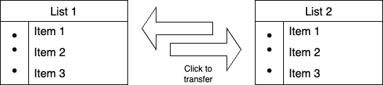

# Transfer List Project

This project is designed to manage and facilitate the transfer of items between different entities. It provides functionalities such as adding items to the transfer list, removing items from the list, and processing the transfers.



<!-- write contrabitutaion guide -->

## Getting Started

### Prerequisites

- [Node.js](https://nodejs.org/en/)

### Installation

1. Clone the repo
   ```sh
   git clone https://github.com/mahmudulnayeem/react-transfer-list.git
   ```
2. Install NPM packages
   ```sh
   npm install
   ```
3. Run the app
   ```sh
   npm run dev
   ```
4. Open the app in your browser
   ```sh
   http://localhost:3000/
   ```

## Contributing

Contributions make the open-source community such an amazing place to learn, inspire, and create. I would greatly appreciate any contributions you make. Please read the [Contribution Guide](./CONTRIBUTING.md) for more details.
